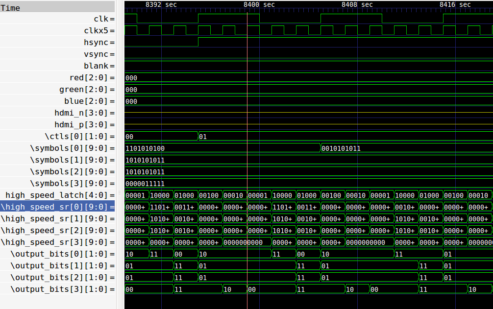
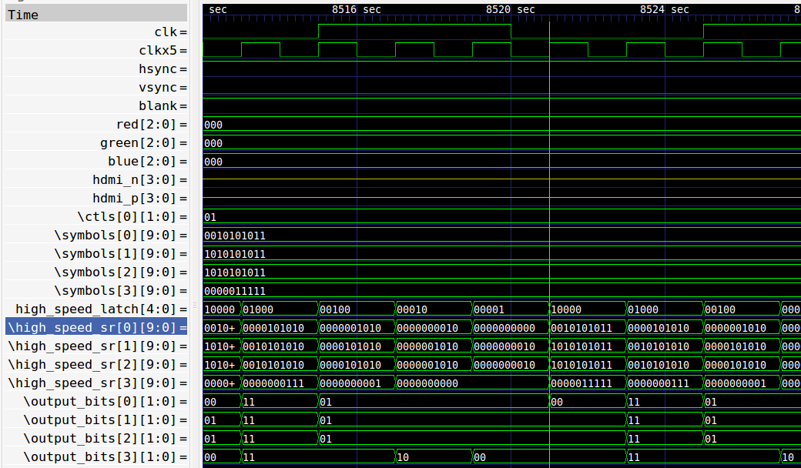
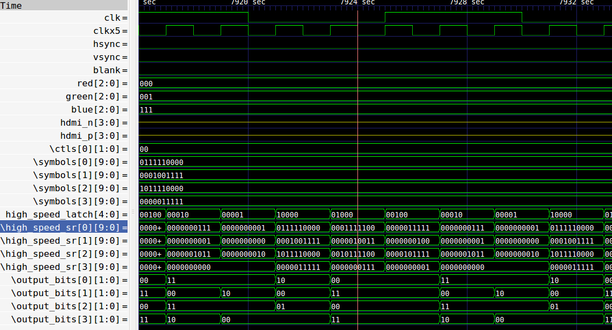
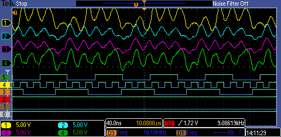
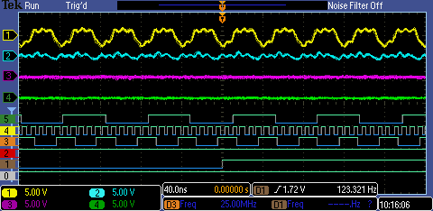

# DVI-D in Verilog use IceStorm open tools

Minimal DVI-D output based on Mike Field's work (see credits below).

# Current status

* differential DDR lines are working
* can set different clocks speeds for testing (need lower clock for my scope)
* can't get generate loop to work to create the differential DDR blocks
* TMDS output is not supported by the lattice chip on the icestick and mystorm
 boards

## GTKwave traces

I think these show that the verilog is correct, at least it is what I expect.

Shows correct TMDS symbols for blanking

Shows correct TMDS for hsync

Shows correct TMDS for RGB = 000, 001, 111.

## Scope pics

Following pics are with the x5 clock for DVI output set to 50MHz (target is
200MHz). Top 4 traces are Clock, R, G, B. Bottom 5 traces are 12MHz clock, DVI
clock (50MHz), VGA clock (10MHz), blank, vsync, hsync.

Hsync and Vsync zoomed out

Hsync zoomed in

I can just about read the lines, it would be good to see the logic levels
recovered by the monitor when adding the negative sides of the signals.

## Electrical connections

I'm not even sure if I can do this on a breadboard, here's the [current messy
status](https://goo.gl/photos/bQrL8b5GGyBhnb3S8)

There are no external components, the differential lines are going straight to
the DVI-D breakout. If I can get something looking promising, the plan is to
make a PMOD DVI-D breakout.

Update: tried with 1nf cap on each differential line and a 100R termination
resistor - outputs look very bad and monitor doesn't detect signal. Next step is
to try with a board and SMT components to minimise cross talk.

# Resources / Credits

lots of thanks to Mike Field of [hamsterworks](http://hamsterworks.co.nz) for
great resources on dvi and vga. Here are some resources I've used in developing
this project.

* http://hamsterworks.co.nz/mediawiki/index.php/VGA_timings
* http://hamsterworks.co.nz/mediawiki/index.php/FPGA_VGA
* https://github.com/jeelabs/fpga/blob/master/quartus/vga1024/top.vga
* ice storm: http://www.clifford.at/icestorm/
* [TMDS/LVDS question](http://electronics.stackexchange.com/questions/130942/transmitting-hdmi-dvi-over-an-fpga-with-no-support-for-tmds) Link to silabs pdf shows a way to interface between LVDS and TMDS with R and 2xC
