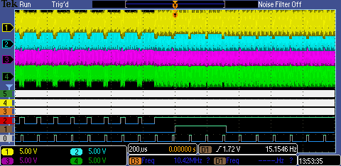

# DVI-D in Verilog use IceStorm open tools

Minimal DVI-D output based on Mike Field's work (see credits below).

# Current status

* differential lines are working
* can set different clocks speeds for testing (need lower clock for my scope)
* RGB and clock are often distorted

I think this is a clock problem to do with getting the data to the DDR blocks.

# Resources / Credits

lots of thanks to Mike Field of [hamsterworks](http://hamsterworks.co.nz) for
great resources on dvi and vga. Here are some resources I've used in developing
this project.

* http://hamsterworks.co.nz/mediawiki/index.php/VGA_timings
* http://hamsterworks.co.nz/mediawiki/index.php/FPGA_VGA
* https://github.com/jeelabs/fpga/blob/master/quartus/vga1024/top.vga
